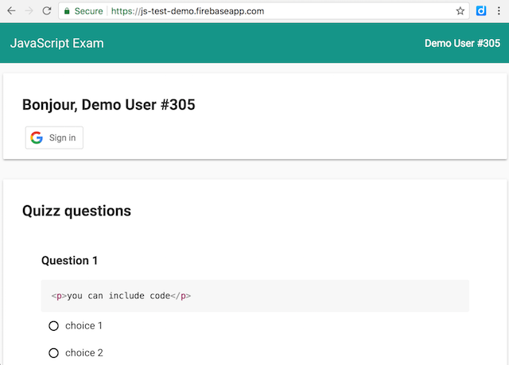

JS-TEST
=======

**A toolkit to help JavaScript teachers evaluate their students' skills more efficiently.**

In the frame of my JavaScript course at EEMI, I developed an online exam application for students, using Google Polymer and Firebase. It's designed to display different variants of each exercise to prevent fraud, and automatic student evaluation/grading, for both quizzes and coding exercises.

It's made of:

- a web app that students will use to give their answers;
- a simple Markdown-based language to define quizz and coding exercises;
- scripts to deploy, evaluate and grade students' answers automatically.

▶️ **Demo video:** *(click to play)*

▶️ **Interactive demo:** *(click to try)*

Features:
---------

- 100% paperless examination/testing/training software, 100% online;
- designed for automated testing and evaluation of students' answers;
- exams/tests defined as Markdown files;
- variants based on student id;
- students identified using their Google Apps account;
- answers submitted to a Firebase account, can be exported to a JSON file;
- students scores can be evaluated in real time, from a web dashboard;
- beautiful UI thanks to Google Polymer and Material Design.

Usage:
------

- Fork, then clone the repo locally
- Run `npm install` to install dependencies,
- Run `npm run create` to generate sample exercises and configuration to `/exam-data`,
- Update exercises files (`/exam-data/*.md`) using Markdown formatting and Mustache variables (see [howto](docs/howto-write-templates.md)),
- Run `npm run build` to compile exercise data into `/public/scripts/exam-data.js`,
- Run `npm start` to start the web server locally,
- Open [localhost:8000](http://localhost:8000) to test the web client locally.

How to deploy a test to Firebase
--------------------------------

1. Create a new project on [Firebase](https://console.firebase.google.com)
2. Click on "Add Firebase to your web app"
3. Copy the values of the given `apiKey`, `databaseURL` and `messagingSenderId` properties to the `FIREBASE_CONFIG` object of your `/exam-data/exam-config.js` file (i.e. overwrite existing values)
4. Still in your `/exam-data/exam-config.js` file:
    - set `backend.type` to `firebase`,
    - un-comment the `FIREBASE_CONFIG` object.
5. Also copy the value of the given `projectId` property to the `/.firebaserc` file
6. Run `npm run build` to re-compile your configuration into `/public/scripts/exam-data.js`
7. Run `npm run deploy-firebase` to push the project to production on Firebase Hosting
8. Test your Firebase project from the given URL, by simulating a student's submission

ℹ️️ After disabling `PUBLIC_TEST_MODE` in `/exam-data/exam-config.js`, don't forget to toggle the `active` property (to `1` or `0`) of your Firebase database, to (de-)activate student access to the test.

⚠️ Security notice: *You may want to protect your Firebase database to prevent accidental or malicious data alteration/loss, as explained in `/public/scripts/app-firebase.js`.*

How to evaluate and grade submitted answers
-------------------------------------------

At all times, you can:

- Go to the "Database" section of your Firebase project's dashboard to see the submitted answers
- Export the submitted data as a JSON file, for backup and/or offline evaluation and grading

After having run the steps above, you can either:

- Run `npm run eval` to compute the scores of answers stored in your Firebase database;
- Or `npm run eval-firebase-export` to do it offline, from a JSON export of your Firebase database.

In both cases, resulting grades will be stored in the `/exam-data/scores.csv` file.

How to enable student identification
------------------------------------

ℹ️️ *These instructions are not complete yet.*

- Change Google's client ID (from `/exam-data/exam-config.js`) so that students can identify using your own google apps domain name (or localhost),
- `build` and `deploy` again to your test's hosting account. (e.g. Firebase or Heroku)

Roadmap
-------

- Add variants to Quizzes.
- Allow per-variable variants. => more combinations.
- Add access rules. (per student group and timeslot)
